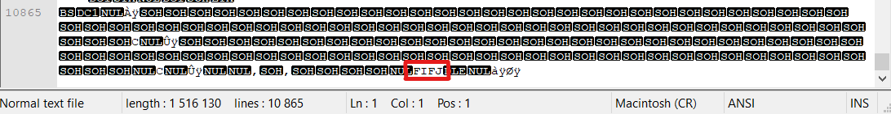

# gepj
**Category:** Bonus
**Points:** 250
**Solves:** 12
**Description:**

>This is a bonus challenge! Solve it and get the flag for sum pointz
>
>Flag is in format: CC##-####-#####-####-####
>
>[gepj.zip](./gepj.zip)

# Write-up
by BubblyPen

By unzipping the zip file you get a folder. Inside the folder are two files: pfft.gepj and tfft.pjge. Pfft.gepj file seemed interesting, because gepj in reverse is jpeg. For this challange I used [CyberChef](https://gchq.github.io/CyberChef/). I uploaded the .gepj file to CyberChef and reversed the file. Downloaded it and opened it. The flag was there. 

***Flag:*** CC19-hgF1-8lkn7-HgjK-82xt

# Write-up w/ PowerShell
by chirbard

Unzipped folder has two files: pfft.gepj and tfft.pjge.

The file pfft.gepj has a reversed jpeg tag at the end, that means all the bytes in the file are reversed.

File locations have to be added to [reverse_image_bytes.ps1](https://github.com/MikeWazowski666/AVHack-writeup/blob/main/Bonus/gepj/tag_at_the_end_of_the_file.png) and it will output a new image with the flag inside.
