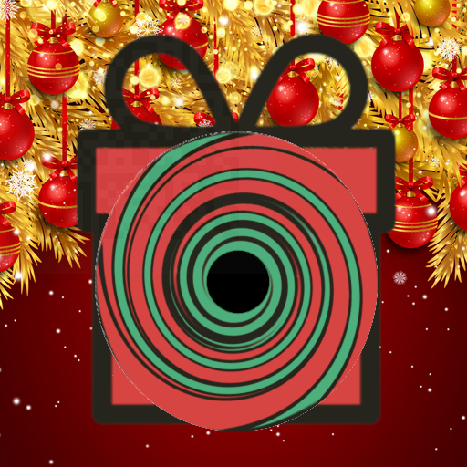

# What is this?
**Category:** Hard
**Points:** 600
**Solves:** 20
**Description:**

>Oh no! Your poor flag was sucked into another dimension. Go on, reach in deep and retrieve it.
>
>NB! Flag is in format: CC##-####-####-####-####
>
>[blackhole.png](./blackhole.png)

# Write-up
by BubblyPen

When I opened the picture I saw that there was a QR code barely visible. 

I fired up stegsolve and searched for the flag from there. The QR code was visible on Blue plane 1 and 2. 

Flag in stegsolve:

***Flag:*** CC20-1ti5-4ll1-nth3-b1ts