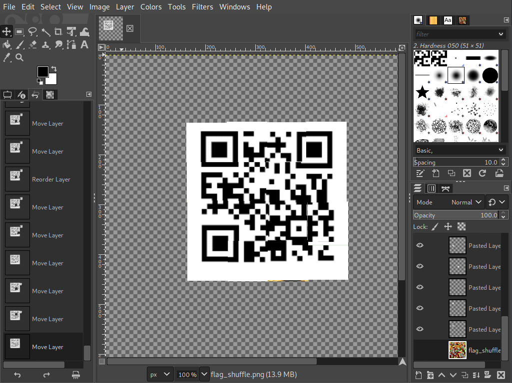

# Puzzling
**Category:** Medium
**Points:** 400
**Solves:** 26
**Description:**

>Santa fell down the chimney and broke your present. Fix it and claim your prize!
>
>Flag is in format: XM##-####-####-####-####
>
>[flag_shuffle.png](./flag_shuffle.png)

# Write-up
by BubblyPen

When opening the file, you can see it's a QR code. 

Open up GIMP. Select the QR code pieces and cut-paste them to another layer. Then rearrange them to get the flag.

***Flag:*** XM18-l3ts-sT4r-tniZ-n3zy
